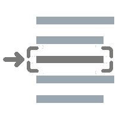

> **[READ ONLY] Subtree split of the [siyuan-packages-monorepo](https://github.com/Zuoqiu-Yingyi/siyuan-packages-monorepo) [/workspace/widgets/metadata](https://github.com/Zuoqiu-Yingyi/siyuan-packages-monorepo/tree/main/workspace/widgets/metadata)**

<div align="center">


---
[](https://github.com/Zuoqiu-Yingyi/widget-metadata/releases/latest)
[](https://github.com/Zuoqiu-Yingyi/widget-metadata/releases/latest)
[](https://github.com/Zuoqiu-Yingyi/widget-metadata/blob/main/LICENSE)
[](https://github.com/Zuoqiu-Yingyi/widget-metadata/commits/main)


[](https://github.com/Zuoqiu-Yingyi/widget-metadata/releases)

---
</div>

## USER GUIDE

[简体中文](./public/README_zh_CN.md) \| [English](./public/README.md)

## DEVELOPMENT GUIDE

### RELEASE STEPS

1. Update the version number in `<subrepo-root-dir>/package.json` and `<subrepo-root-dir>/public/plugin.json`, then commit the changes in [monorepo](https://github.com/Zuoqiu-Yingyi/siyuan-packages-monorepo).
2. Run script `./scripts/git-subtree/metadata/push.ps1` with the folowing command in **monorepo root dir** to push the subtree to sub-repository (`dev` branch).
   ```powershell
   pwsh -f "./scripts/git-subtree/metadata/push.ps1"
   ```
3. Create a pull request from `dev` branch to `main` branch in sub-repository.
4. Merge the pull request.
5. Await for the CD workflow `release-please.yml` to complete, it will create a *release pull request* in sub-repository.
6. Merge the *release pull request*, it will create a new *pre-release* with current [changelog](./CHANGELOG.md) and a new *tag* with [semantic version](https://semver.org/) in sub-repository.
7. Await for the CD workflow `build.yml` to complete, it will update the distribution files to `publish` branch in sub-repository.
8. Await for the CD workflow `release-distribution.yml` to complete, it will create a new *pre-release* with an asset named `package.zip` and a new *tag* with timestamp in sub-repository.

## CHANGELOG

[CHANGE LOG](./CHANGELOG.md)
