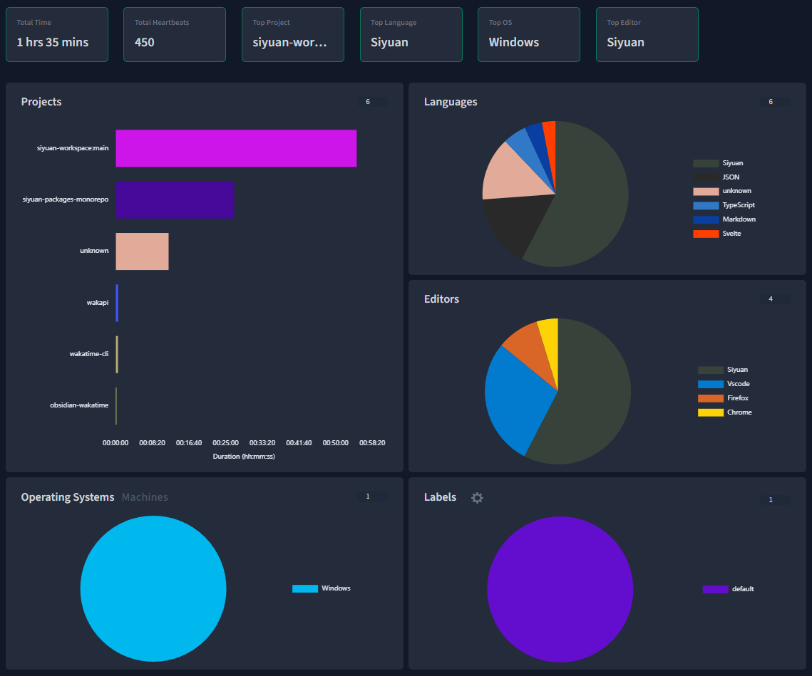

# widget-metadata

一个适用于 [思源笔记](https://github.com/siyuan-note/siyuan) 的文档块元数据挂件  
A Widget of document block metadata for [SiYuan Note](https://github.com/siyuan-note/siyuan).

## 预览 | PREVIEW

  

## 功能介绍 | FUNCTIONAL DESCRIPTION

- 编辑文档块的基本属性  
  Edit the basic attributes of document block.
  - `created`
    - 文档创建时间 | Document Creation Time
  - `updated`
    - 文档修改时间 | Document Modification Time
  - `title`
    - 文档标题 | Document Title
  - `name`
    - 文档命名 | Document Name
  - `alias`
    - 文档别名 | Document Alias
  - `tags`
    - 文档标签 | Document Tags
  - `bookmark`
    - 文档书签 | Document Bookmark
  - `memo`
    - 文档备注 | Document Memo
- 编辑文档块的自定义属性  
  Edit the custom attributes of document block.
  - `custom-*`
    - 自定义属性名仅能包含 `a-z`, `A-Z`, `0-9`, `-`  
      Custom attribute name can contain only `a-z`, `A-Z`, `0-9`, `-`
    - 自定义属性值为空时删除该属性  
      Delete the custom attribute when the attribute value is empty.
- 编辑文档块的其他属性  
  Edit the custom attributes of document block.
  - `id`
    - 文档标识 | Document Identification
  - `icon`
    - 文档图标 | Document Icon
  - `scroll`
    - 文档浏览位置 | Document Browse Location
  - `title-img`
    - 文档题头图 | Document Cover Image

## 开始 | START

该挂件已在[思源笔记社区集市](https://github.com/siyuan-note/bazaar)上架, 可直接在集市中安装  
The widget has been put on the shelves at [SiYuan community bazaar](https://github.com/siyuan-note/bazaar) and can be installed directly in the Bazaar.

## 参考 & 感谢 | REFERENCE & THANKS

## 依赖 | DEPENDENCIES

| 作者 \| Author                                    | 项目 \| Project                                                                                                           | 许可证 \| License                                                                 |
| :------------------------------------------------ | :------------------------------------------------------------------------------------------------------------------------ | :-------------------------------------------------------------------------------- |
| **[vitejs](https://github.com/vitejs)**           | [vitejs/vite: Next generation frontend tooling. It's fast!](https://github.com/vitejs/vite)                               | *[MIT license](https://github.com/vitejs/vite/blob/main/LICENSE)*                 |
| **[vuejs](https://github.com/vuejs)**             | [vuejs/vue: This is the repo for Vue 2. For Vue 3, go to https://github.com/vuejs/core](https://github.com/vuejs/vue)     | *[MIT license](https://github.com/vuejs/vue/blob/main/LICENSE)*                   |
| **[kazupon](https://github.com/kazupon)**         | [kazupon/vue-i18n: Internationalization plugin for Vue.js](https://github.com/kazupon/vue-i18n)                           | *[MIT license](https://github.com/kazupon/vue-i18n/blob/v8.x/LICENSE)*            |
| **[arco-design](https://github.com/arco-design)** | [arco-design/arco-design-vue: A Vue.js 3 UI Library based on Arco Design](https://github.com/arco-design/arco-design-vue) | *[MIT license](https://github.com/arco-design/arco-design-vue/blob/main/LICENSE)* |
| **[moment](https://github.com/moment)**           | [GitHub - moment/moment: Parse, validate, manipulate, and display dates in javascript.](https://github.com/moment/moment) | *[MIT license](https://github.com/moment/moment/blob/develop/LICENSE)*            |

注: 按引入时间排序
ps: Sort by introduction time.

## 更改日志 | CHANGE LOGS

[CHANGELOG](./CHANGELOG.md)
